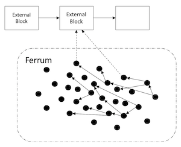

**Ferrum**, A decentralized network and exchange that extends across different block-chain technologies

## Abstract
We live in a multi-token world. Bitcoin, Ether, Ripple, Iota and EOS are all examples of major digital currencies in the marketplace that exist across separate blockchains. Currently, such digital currencies can only be exchanged in traditional centralized exchanges, through costly and slow atomic swaps, or in the case of ERC20 tokens, on decentralized ERC20 token exchanges. However, a decentralized network permitting the fast and inexpensive exchange of assets across different blockchains, such as the direct exchange of Bitcoin for Ether, has not yet been created. In addition, thousands of legitimate tokens, each with their own unique use cases and value proposition, are effectively excluded from market because they are not listed on any exchange, greatly limiting their adoption and utility. Moreover, slow transaction speeds, volatility, and hefty fees are impeding cryptocurrencies from functioning as an everyday unit of exchange. The ability to transact value from every single blockchain on a single decentralized network will prove extremely useful in solving these problems. Ferrum network is that solution. 

In this paper, we propose a decentralized network that can cryptographically represent other digital assets to be used as a medium of exchange between different assets that are backed by either centralized or decentralized technologies. We discuss a protocol called Ferrum and its implemented cryptocurrency called Fe. The value of every Fe is pegged to another cryptocurrency, and it can be imported or exported in relation to the underlying cryptocurrencies it represents. For example, users can convert their Bitcoins to a Fe equivalent, and execute countless fast transactions on the Ferrum network with very minimal costs, thereby avoiding the slow transaction speeds and high fees experienced in the Bitcoin network. Users can further convert their Fe back to any other originating crypto-currency supported by the Ferrum network. We propose an implementation of Ferrum based on a directed acyclic graph (DAG) ledger (similar to IOTA). We claim graph-based decentralized systems have some inherent benefits over traditional blockchain systems, such as nearly costless transactions and improved scalability. We utilize concepts that we call Proof of Burn, External Proof, and Futures to enable this cross-chain exchange.

## Introduction

Crypto-currencies such as Bitcoin and Ethereum have recently got so much press that there is no need for an introduction to the concepts of blockchain and crypto currencies. Readers can refer to [wiki-blockchain] for more information. The price of bitcoin has seen phenomenal growth, and attention of public and institutional investors have significantly increased the potential of using top cryptocurrencies as a long-term store of value. Additionally, the open sourced nature of blockchain and cryptocurrency technology is widely experimental with hundreds of different coins and distributed ledgers on the market. As long as bad actors are driven from the space, we view the pace of innovation and proliferation of utility tokens as a net positive. However, the dynamism of innovation is often at odds with the real-world limitations of the adopting markets. For instance, according to an investigation Business Insider, as of March, 2018, centralized exchanges were charging $50,000 to $1,000,000 to list an “altcoin”. It seems we have retuned to a system where centralized gatekeepers wield most of the power, increasing the risk that that only a few projects will survive and resulting in the death of the majority of innovations. Old-fashioned centralized exchanges, which are trust-based businesses, facilitate the exchange of crypto-currencies based on traditional centralized and fee-based business structures. Currently, there is no organic solution for communities to support their decentralized technologies. Instead, they need to rely on exchanges to adopt their technologies before users can buy into their platform.

In this paper, we propose a decentralized network with a distributed exchange protocol called Ferrum that aims to solve several challenges set forth in this paper. Ferrum acts as an intermediate network, utlizing plugins to allow for the exchange the value between external networks or blockchains. Every project, no matter how small, can now plug into the Ferrum network, permitting them to exchange their currency with willing parties on the network that adopt their plug-in, thereby eliminating the need for any trusted party and enabling a truly global and organic exchange.

In the next few paragraphs we present the several challenges in the world of crypto-currencies that motivated the design of *Ferrum*:

- **Bitcoin is not a good currency but is a good store of value**. For something to achieve status as a currency, it must be a store of value, unit of account, and medium of exchange. Bitcoin and a few other major cryptocurrencies have established themselves as a good store of value and unit of account. This is great news for the world of crypto-currencies, but it is not sufficient if cryptocurrency is going to become mainstream. We can think of Bitcoin as digital gold. The scarcity of gold has made it a global store of value that can be used to back the value of other assets, however gold cannot be practically used in day-to-day transactions. Although it is possible to conceive a world in which people buy their morning coffee by passing a miniscule particle of gold to the barista, it is not a probable outcome. Moreover, the price volatility of bitcoin dissuades most from transacting with it. Enter the Ferrum network. Ferrum supports a crypto-currency (Fe(BTC)) that is backed by Bitcoin and can be transacted with minimal fees, near-instant transaction speeds, and negligible environmental impact. Fe(BTC) can be cheaply and reliably converted to and from Bitcoin, or other any other crypto-currencies, without volatility. It is important for the derived transaction to present no volatility in value in relation to the external cryptocurrency it represents. The promise of the Ferrum network is that with enough liquidity, users would rarely need to transfer their currencies back to the external crypto-currency. Fe can be used as a token for spending Bitcoin (BTC) or other crypto-currencies. For example, if a coffee costs BTC 0.0002, consumer will pay the amount of coffee in BTC to the seller, but the transaction happens under a second over the Ferrum network with negligible transaction fees.

- **Exchanges are not decentralized** Blockchain and cryptocurrencies were supposed to provide a trustless decentralized means for peer-to-peer transactions. However, in reality, a majority of cryptocurrencies are held and transacted through a few big companies and exchanges such as Coinbase, Binance and Bittrex. The current situation is far from the promised world of decentralized transactions and community owned currencies, and is more akin to the traditional, but less effective banking system, resulting is some of the scalability issues and expensive transaction fees. There is clearly a need for a decentralized exchange where once can contribute to the system with no need to trust or rely on giant corporations. This is by far the biggest failure of crypto currencies, and the need to address this problem is keenly felt by the community and consumers. Ideally, the transfer of value should be able to happen without the need to resort back to fiat currencies or traditional trust-based organizations. Ferrum network fills this gap by providing an intermediate network for exchange of values across different crypto-currencies, and potentially fiat currencies.

*Ferrum* network and *Fe* are designed to solve above problems. In the rest of this paper we propose the *Ferrum* network and its essential concepts. 

## The ***Ferrum*** network

In a general form, *Ferrum* network is a peer-to-peer distributed network in which the following statements are true:

- **Read-only access to other external networks**. All or some nodes on a *Ferrum* network should be able to read information from one or more external networks. For example, a *Ferrum* node could validate transactions from the Bitcoin blockchain.
- **Irreversible transactions into the network from an external network**. There must be a method of transacting into the *Ferrum* network from external networks - such as sending Bitcoins into the *Ferrum* network. Such transactions cannot be reversible, meaning the originator cannot double spend the Bitcoins or undo the transaction. Such guarantees should be made possible without modification of the external network.
- **Delayed transactions**. A transaction on the *Ferrum* network can be delayed. We call such transactions *Futures*. A future transaction can be considered void after the agreed-upon time is reached, and the underlying condition of transaction is not met. It suffices to limit the underlying condition to the "completion of another transaction". This is a special case of smart contracts, but for *Ferrum* network to work as a distributed exchange, no custom contract other than the above (*Futures*) needs to be supported.

### The *Fe*

The subjects of transactions on the *Ferrum* network is *Fe*, which, for the lack of better world we refer as a *Crypto-currency*. *Fe*, however, is not a crypto-currency in and of itself. Instead, the value of *Fe* is a function of the values of external crypto-currencies it represents. To clarify, imagine the following scenario:

Alice generates 1 *Fe*s by transferring one Bitcoin to the *Ferrum* network. She then generates another *Fe* by transferring one Ether to the *Ferrum* network. Alice now has 2 *Fe*s but her total wealth is 1 Bitcoin and 1 Ether. We represent Alice's wealth as *1 Fe(BTC)+ 1 Fe (ETH)*. The general form of Alice's wealth is *Sigma_i(a_i.Fe(i))* where *i* is the external cryptocurrency and *w_i* is the amount for *i*. In-fact a *Fe* wallet is nothing but a surrogate for a portfolio of external cryptocurrencies.

Alice then sends all of her *Fe(ETH)*, plus 50 percent of her *Fe(BTC)* to Eve for her birthday gift. Alice now has only *0.5 Fe(BTC)*, and Eve has *1 Fe(ETH)* and *0.5 Fe(BTC)*. Eve can decide to get back some actual Bitcoins by engaging in a *Future* transaction with Mike. The future transaction can be described as: "Transfer *0.5 Fe(BTC)* from Eves Fe wallet to Mike's Fe wallet, under the following condition; Transfer of 0.5 Bitcoin from Bitcoin Wallet W0 to Bitcoin Wallet W1 has happened before tomorrow 12:00pm". Wallets W0 and W1 are Bitcoin wallets where Mike and Eve have agreed upon before starting the *Future* transaction. If the external transaction is completed before the agreed time, Eve's *Fe* would be invalidated and Mike would own *0.5 Fe(BTC)*. Otherwise *Fe* would be release back to Eve and Mike ends up with nothing.

The Future transaction is constrained by the *Ferrum* network, such that Bitcoins can only be transacted with *Fe(BTC)* of the exact same value. Although *Fe(BTC)* can freely be transacted by *Fe(ETH)*, external futures are required to happen with exchange rate of 1.
The obvious question here is what motivates Mike to converts his Bitcoins to *Fe(BTC)*? Once the *Ferrum* network achieves enough maturity the only motivation that Mike needs is access to *Fe* which would allow him to buy goods or exchange crypto-currencies without fees, but until such level of maturity is achieved a market maker may be required to provide liquidity and compensate for the lack of motivation for burning external assets.

Figure 1. Ferrum nodes have readonly access to external networks

### External Network Plugins

For the *Ferrum* network to act as a decentralized exchange, it needs to be able to talk to external networks. The implementation of Ferrum network allows this by utilizing a plugin model. Every plugin has a unique identifier, a version and a signature. It then implements the *Ferrum* network interface. Nodes may adopt a plugin for an external network. There might be several plugins for an external network such as Bitcoin. It would be up to the community to use any of them. Unreliable plugins would be rejected by the community. 

Plugins also define the proof of burn addresses as a means of generating *Fe*. We describe the proof of burn concept in the next section. It is important for the community to adopt reliable plugins or a bad actor can use his personal address for the proof of burn address and use all the external currency that were supposed to be burned but weren't. Nodes can also choose to use multiple plugins with an *AND* or some other voting mechanism for validating external transactions (For example, one can use the validation result from three different Bitcoin plugins before issuing a *Fe(BTC)* transaction for increased security). 

Transactions originated from new plugin that are not widely accepted would still be validated by normal nodes, however; if a node is validating a transaction does not have the appropriate plugin, it only validates the chain up to the network edge. To issue an edge transaction, one would need to do some proof of work. This will help prevent spamming the network with invalid edge transactions.

Although an edge transactions cannot be confirmed by users that do not have the appropriate plugin installed, they can be included in the validation process. There is little incentive for a bad actor to create invalid edge transactions (e.g. generating *Fe(BTC)* without burning any Bitcoin). The bad actor needs to create proof of work, however the created *Fe(BTC)* as the result of this edge transactions would be invalid. Although other nodes without the appropriate plugin could validate these edge transactions, an eventual buyer of *Fe(Bitcoin)* would inevitably have the right plugin installed and can confirm that those *Fe(BTC)* are invalid. Hence a bad actor cannot generate value from thin air. 

We use the notation *Fe(0)* to call a worthless *Fe*. To a node without plugin *X*, *Fe(X)* is equal to *Fe(0)* and acts like an empty transaction. Generating *Fe(0)* is a way to contribute to the network security since to generate one *Fe(0)* one has to validate at least two other transactions. If you are not familiar with the concept of graph based transaction validation see [http://www.tangleblog.com/wp-content/uploads/2016/11/IOTA_Whitepaper.pdf].

*Ferrum* implementation would have hard-coded names for external networks (e.g. Bitcoin, Ethereum, etc.). Plugins can introduce new external networks by extending the default list. It would be up to the community to ensure the validity of a plugin and uniqueness of the names other than the ones in the reference implementation.  

With external network plugins, any mature or experimental crypto currency can be exchanged on *Ferrum* without a need to trust or ask permission from any person or entity as long as enough people are willing to do so.

### Edge Transactions

There are two essential types of transaction in the *Ferrum* network. The internal transaction which can be understood by all the nodes, and the edge transactions which are transactions that rely on validation of another transaction in external networks. The edge transactions can only be validated by the nodes that are running the appropriate plugin.

There are two types of edge transactions in *Ferrum* network: external claim, and future exchange. External claim is used to claim an address in an external network and future exchange is used to exchange *Fe* with its equivalent external value.

### Proof of Burn

Proof of burn one method for creating *Fe*s in the Ferrum network. We define proof of burn as **Sending value to an address such that the funds become provably not spendable afterwards**. Another method is to have a reverse claim using smart contract on networks that support smart contracts. This method is out of the scope of this paper.

Let *X* be than external network to *Ferrum*. Let *a_X_0* be the address in the *X* network that is not spendable. Any funds sent to *a_X_0* will be effectively disappeared. Let *a_X_p* be the address *p* in network *X*. One can generate *Fe(X)* by burning funds in *X* which means transferring funds from *a_X_p* to *a_X_0*, then claiming equivalent amount of *Fe(X)* pointing to the relevant transaction on network *X* as proof.

Above transaction on the *X* network is not enough to constitute a safe proof of work mechanism. Because any person can watch transactions coming to *a_X_0* and immediately claim the equivalent *Fe(X)* as theirs. To mitigate this problem we should modify the proof of burn protocol as follows:

> Owner of funds *a_X_p*, first; creates an address *a_X_p'* in network *X*. She then creates a wallet *p'* in *Ferrum* network and claims her *Fe(X)*. At this point these claimed *Fe(X)* are worthless because they are not backed by a transaction *a_X_p'* -> *a_X_0*. Now she initiates a transaction from *a_X_p* to *a_X_p'* then another transaction from *a_X_p'* to *a_X_0*. Once these two transactions complete, her *Fe(X)* become valid and she will be able to spend them.

In the above proof of burn protocol, anybody can see the newly claimed *Fe(X)* on the *Ferrum* network, but this information does not make it any easier to steal funds.

### Futures

A future, is a transaction that executes in some future time. *Ferrum* uses two future protocols to allow exchange of value with external networks: Proof of burn futures, and Edge futures.

- Proof of burn futures: The proof of burn future is the only future that does not involve a specific time. It involves two transactions, one to claim *Fe(X)* in the form of claiming value into *a_p'* (a *Ferrum* address). *a_p'* is created to match an external address *a_X_p'* and is used as proof that the user owns an external address. Another transaction is made to claim value from *X* presenting proof by pointing to the external transaction *a_X_p' -> a_X_0*.
- Edge futures: In addition to proof of burn, edge futures provide means of transacting between *Ferrum* network and an external network *X*. An edge future is a transaction that happens between *Alice* and *Bob* and in the process they exchange *Fe(X)* with equivalent amount of value from *X* at future time *t_f*. Let *a_X_a* be Alice's address in *X* and *a_X_b* be Bob's address in *X*. Also *a_a* is Alice's address in *Ferrum*. Alice already has value in her address *a_a*. She will create a special temporary address *a_a'* plus another permanent address *a_a''*. Bob will also create an address *a_b*. Alice will send a special transaction *T_a,a',a'',b*: *a_a* -> *a_a'*with a reference time *t_f*. *T_a,a',a'',b* references *a_a''* as the *rollback address*, and *a_b* as the *target address*. *T_a,a',a'',b* will also have a condition *a_X_b* -> *a_X_a* for a set amount. Note that Alice and Bob have already agreed on the external addresses, the amount, and the future time *t_f*. *t_f* could also be influence by the plugin to ensure enough time is passed for the transaction *a_X_b* -> *a_X_a* in network *X* be completed irreversibly. Up until *t_f+buffer* is reached, funds in *a_a'* are locked. After *t_f*, *T_a,a',a'',b* will be read as *T_a',b* if the condition is fulfilled, or *T_a',a''* if the condition is not fulfilled, hence the transaction is rolled back. A node that does not have the relevant plugin for *X* cannot validate an edge transaction, so it can assume that either *T_a',a''* or *T_a',b* are valid. However, Alice or Bob can only use their *Fe_X* if the node accepting their funds has the appropriate plugin and can validate the Edge transaction.

### In-network Exchange

The in-network exchange is much simpler than cross-chain exchange. The in-network exchange is not also limitted to a single asset. Users can exchange portfolios of assets with one exchange transaction. Alice wants to exchange *a_V = Sigma_i w_i.Fe(i)* which is a portfolio of assets with Bob's *b_V = Sigma_j w_i.Fe(j)*. They have to agree on the exchange beforehand, so *a_V* and *b_V* are known. Alice will create sumbit an exchange transaction *T_ax=T_a,V,b",a",b_V*, where *a* is her address with the values, *V* is short for *a_V*. *b
* is Bob's address, and *a"* is a roll-back address. Once the exchange transaction is approved on the network two other transactions become possible. 1) Alice can roll back this transaction by submiting *T_ar=T_V,a",t_a_x* which has the samve value as *T_ax*. This transaction is claims *a_V* and requests the value to be added to roll-back address *a"*. 2) Bob can claim the value in *T_ax* by providing the transaction *T_bc=T_t_ax,b",b_V,a"*. This transaction points to *T_ax* as proof and sends the exchange value *b_V* from address *b* to *a"* and at the same time claims *a_V* and requests the value to be added to *b" *

Both roll-back and claim transaction point to *T_ax* as proof, but only one of them could be valid at a time. The first transaction between *T_ar* and *T_bc* that gets approved by the network is considered valid. So if Alice beats Bob to rolling her transaction back, Bob cannot claim the exchange and both Alice and Bob get to keep their portfloio. But if Bob claims the exchange transaction before Alice rolls it back the exchange has happened successfully and Alice will gain *b_V* and Bob will gain *a_V*.

### (Tracing the) Value of *Fe*

Any node that wants to accept an *Fe*, needs to be able to trace its value to the original proof of burn transaction that created that *Fe*. The tracing is not any different than chasing the parent of each transaction. The node needs to have the appropriate plugin installed to be able to validate the edge transaction and ensure the *Fe* has real value according to the external network.

### Issuing Tokens

Currently Ethereum network is used for issuing ERC-20 token. ERC-20 Tokens are not first class citizens of the Ethereum network. Instead, they are generated using a specific type of smart contract that manages gigantic hash-maps. This is on of the main reasons that the transactions on ERC-20 tokens are not scalable.

 Ferrum is designed to allow developers to create new tokens. *Fe(BTC)* or *Fe(ETH)* are tokens that are backed by external value. In Ferrum, we introduce a new type of transaction, which we call the *Genesis Transaction*. The genesis transaction issues a new set of tokens that are not backed by anything. A genesis transaction has the following extra fields: *Number of tokens*, and *Is Open Ended*. The genesis transaction can be created by a smart contract or a normal account. The creator of an open ended genesis transaction can create more genesis transactions. The only account able to spend from the genesis transaction is the originator, being a normal account or a smart contract.

### Incentives

To ensure the equivalence of values in the *Ferrum* network with the external network, it is specifically designed to be inflation free. Any inflation (creation of *Fe* not backed with an external currency) will create more *Fe(X)* than burned currency from *X*  which disrupts the value equivalency between *Fe(X)* and *X*. This means we cannot reward people with *Fe(X)* for converting external currencies.

Once the *Ferrum* network is large enough, the ability of transacting for free is enough for people to convert an external currency to *Fe*, but until then we need to find practical incentives for the users without causing inflation. Coming up with practical incentive mechanisms is still work in progress.

## Supporting Fiat Currencies in Ferrum

The protocols that allows Ferrum to see across networks, is simple enough that is not specifically bound to crypto-currencies. An entity holding fiat currencies may as well expose such protocols and allow generation of *Fe(USD)* and *Fe(EUR)* or any other currency in the world. Once fiat currencies are entered the *Ferrum* network, they can be freely transacted or exchanged by each other or any other crypto-currency.

For example, in a hypothetical scenario an Australian financial institution can provide the following public interfaces to their bank account database.
1. A funding lock account number, that has no owner and any transactions sent to that account is not reversible.
2. Giving the ability to users to expose their bank account numbers. No need to expose the account value.
3. A public ledger that shows transactions happened between exposed accounts.

Such an interface is enough to enable generation of *Fe(AUD)* in the *Ferrum* network without requiring trust to the financial institution. A decentralized database can create a duplicate records of the published transactions, thus removing the ability of the financial institution to modify the transaction history.

## Free Transactions and *Fe(PUR)*

To prevent spamming the network, every *Ferrum* transaction needs to present a proof of work. The *Ferrum*'s proof of work is designed to be solvable in a few minutes with a normal laptop. Proof of work attached to the transactions is also used to increase the weight of the transaction and its chance of being picked up by other nodes for validation.  
This in effect distributes the mining and removes the need for dedicated mining nodes. Non-existence of miners enables effectively free transactions. Note that the transactions are free in the sense that one does not need to spend crypto currency for transactions, but they still need to spend compute power. 

A few minutes of a laptop's compute power can be easily spent by a casual user of the cryptocurrencies that does only a few transactions per day. However, this approach is limiting to merchants or users that need to run fast transactions. For example to purchase a coffee with cryptocurrencies using a phone or smartwatch hardware, running proof of work is not possible. We propose a special *Ferrum* token called ***PURE*** or *Fe(PUR)* which can be used instead of proof of work. Users can therefore add weight to their transactions by spending *Fe(PUR)* instead of, or in addition to, proof of work.

### Economic Implications

By introducing *Fe(PUR)* we effectively provide a hash power economy. Users can buy and sell hash power, and the price of hash power depends on the amount of transaction weight each *Fe(PUR)* can buy. It is important to design the system such that this economy would not lead to highly fluctuating or speculative *Fe(PUR)*. The design goal should be a stable and liquid *Fe(PUR)* that can be easily used in transactions.

Let us call the amount of hash power each *Fe(PUR)* can buy *w_p* and the total hash power of the network *W*. 
Here we study several approaches for designing a hash power economy.

1. All *Fe(PUR)*s can buy all hash powers, hence *(Sigma Fe(PUR)).w_p = W*. This is the simplest pricing strategy. Hash power that each *Fe(PUR)* can buy (*w_p*) is total *Fe(PUR)* in circulation over the total hash power. Total *Fe(PUR)* is constant, so as the network grows *Fe(PUR)* becomes more valuable. The main disadvantage of this method is that the value of *Fe(PUR)* is guaranteed to increase every time it is spent which would encourage holding and damage liquidity of the network.

2. Constant *w_p*. If *w_p* is set as a constant value, any speculation on the *Fe(PUR)* becomes unprofitable and users would have no motivation to hold any *Fe(PUR)*. Problem here is that hash power of the network is not constant so there would always be a surplus or deficit of *Fe(PUR)* in the network. One could argue that arbitrage opportunists could effectively stabilize *w_p* but as the hash power of the network grows all the surpluses will disappear and there would be ever increasing deficit of *Fe(PUR)* which again can damage liquidity.

3. Reclaimable *PURE*. To counter the inflammatory effect of option 1, we can allow buy back of *Fe(PUR)* with hash power. This means that users can use spend *Fe(PUR)* to expedite transactions, but they are allowed to buy back the *Fe(PUR)* they have spent by spending hash power. For example one can spend *Fe(PUR)* as transaction fee to buy a cup of coffee but she can get her *Fe(PUR)* back by generating a roll-back transaction and spending the hash power at night. Note that this would not allow a guaranteed price to buy other users *Fe(PUR)*, hence there would still be an open market for *Fe(PUR)*, but the amount of *Fe(PUR)* in circulation remains constant. The only variable here would be the network hash power.

### Fair Transaction Weight

*Ferrum* transactions can carry various actual value. For example 1 *Fe(BTC)* carries a lot more value than 1 *Fe(PUR)*. In theory the network does not need to distinguish between such transactions, but from an economic perspective, any significant divergence in the way a model of an economic system is presented from reality could cause unknown discrepancies in the model. In some sense *Ferrum* is a cryptographically secured model of the external-world, and we believe the better *Ferrum* represents the real-world the less severe are unexpected consequences.

Cost of moving assets is usually proportional to the value of those assets. For example, an exchange where moving 1000 *Bitcoins* costs the same of moving 1 *Bitcoin* is prone to price manipulations as entities can start moving large sums of values around and create fake market situations. If moving 1000 *Bitcoins* is 1000 times more costly than moving a single *Bitcoin* such market manipulations would be too costly to conduct.

Let *v_X* be the normalized value of *Fe(X)*. For example *v_BTC* is the normalized value of *Fe(BTC)* and *v_ETH* is the normalized value of *Fe(ETH)*. If *BTC* and *ETH* are in average exchanged 1 to 10, *v_BTC* would be 10 times higher than *v_ETH*.

In *Ferrum* transaction cost is the weight attached to the transaction which correlates to the hardness of the proof of work solved by the transaction initiator. The proof of work can also be substituted with spending *Fe(PUR)*.  
To accommodate the fair transaction weight, *Ferrum* requires transactions to present at least weight of *Min(transaction_min_weight, value_normalized_transaction_weight)*. The value normalized transaction weight is *Sigma _i (v_i.|i|, |i| < 0)*. *i* is the list of currencies in the transaction. *v_i* is the value of the currency *i* and |i| is amount of currency *i* in the transaction. Not that the weight only correlates to the spent amounts, not received amounts.

## Scalability and Throughput

The major drawback of decentralized ledgers currently in production is the problem of scalability. Currently Ethereum network is only able to process a few transactions per second. Such numbers pale compared to commercial payment processing systems capacities. In this section, we study some reasons behind low throughput and slow transaction time of such networks and discuss how Ferrum network solves these problems.

### Average Distance Between Nodes

A decentralized ledger runs on a distributed network of individual nodes. Such networks are well studied in the context of internet, distributed database systems, and even social networks. Assuming that nodes in a distributed network find their neighbours randomly with a bias toward geographical proximity, we will have an architecture similar to the Internets architecture, but obviously much smaller.

Such networks when represented as graphs are usually consisted of pockets of dense sub graphs connected to create a larger graph. Average distance between nodes, hence the amount of time it takes for a message to reach other nodes grows very slowly even when the network grows very fast. The figure below from (https://arxiv.org/pdf/0706.3322.pdf) shows that the average distance between nodes in such graphs drops sharply after a number between 5 or 10 regardless of the size of the graph.

Figure 2. From (https://arxiv.org/pdf/0706.3322.pdf) showing the probability that distance from a given source node in graph is greater than d.

Since the distance between nodes does not grow too fast, load on nodes will grow as fast as the network, hence, size of the network is effectively bound by the processing power of the average node. This is a huge limiting factor. The typical next step to break down the load on the network is sharding, but sharding is not easy for the block-chain because of the consensus mechanism.

In addition to the density of the network graph, block-chains are limited by the consensus mechanism. One can think of a block-chain as an exponentially expanding tree were the network has to work very hard to prune this exponentially large tree to only one branch. This property also makes blockchain specially sensitive to network partitions.

A graph based network such as Ferrum on the other hand is self organizing, in the sense that no pruning of a tree is required. A graph will organically form. It can be partitioned but the partitions can be join together with new nodes. The consistency of the ledger is guaranteed by back tracking the graph, not pruning branches.

This property makes graph based networks such as Ferrum specially suitable for randomized algorithms. If each nodes only hold and processes a random sample of the transactions, the whole graph would still remain consistent. Individual transactions can be validated using local knowledge but to ensure consistency of the graph, hence no double spending, the node should ask its neighbours to provide it the necessary transaction list. Note that there is no need to import the whole graph, but it is enough to collect the path that contains the validated transactions up to a point that is already validated locally.

Using such randomized algorithms the network as a whole would have all the state while every individual node would only contain a small part of it.

### Flag Bearers

A useful financial transaction system is expected to be highly reliable and support very high throughput of transactions. These properties are almost trivial in distributed centralized systems, but they are very hard in peer-to-peer decentralized systems. Beauty of graph based transaction systems such as Ferrum is that it enables us to mix these two approaches; distributed centralized nodes with peer-to-peer decentralized nodes without compromising trust. Flag bearers which are inspired by IOTA implementation, are very powerful distributed nodes that process all transactions and facilitate the graph's convergence.

Imagine a chaotic medieval army marching through a complicated terrain. A number of soldiers in front of the line are carrying tall flags and the large army will follow them. These flag-bearer soldiers are not commanders and have no authority but their existence by convention will bring order to the chaotic army of people. Flag bearers in the Ferrum network are similar nodes. They are not trusted to validate transaction, but they are expected to submit "zero" value transactions that converge the graph and they are expected to chose a consistent convergence path for the graph. In return they are allowed to submit 0 value transactions without fees or proof of work. In other words flag bearers are nodes that are trusted only enough that they will not spam the network. If a flag bearer starts spamming the network or chose inconsistent convergence paths for the graph (e.g. paths with double spending) the community will stop following the flag bearer.

#### Flag Bearers Risk Factors

A naively designed flag bearer can potentially double spend a transaction and branch the graph such that both transactions are valid in their own sub graphs for some time. To prevent such bad behaviours, every flag bearer transaction has a merkle hash of its last transaction. It is also expected that every flag bearer transaction would select a path that contains its last transaction, hence it can never branch the graph by going back or jumping around.

One more potential risk of a naive flag bearer design is ability of starving some transactions. If all flag bearers in the network collude they can potentially starve a person by never picking up her transactions. To counter this measure normal nodes are expected to pick and validate transactions that are not picked up by flag bearers by some probability.

In summary, by introducing flag bearers  as high throughput nodes and randomizing normal nodes, the Ferrum network can scale as well as centralized systems with no compromise on the decentralized trust.

### Hard Sharding for Scalability or Ferrum Colonies

The fact that Ferrum is a network that can read into other networks, presents a new scalability paradigm to the decentralized networks, which we call **colonies**.

Ferrum Colonies consists of a main network which would be connected to all external networks and is best suited for transaction settlements. Other communities can create a spin-off of the main Ferrum network, which can be specialised. Below are the properties of the Feruum spin-offs:

- The only external network they can interact with is the main Ferrum network
- They can create their own coins, and they can import any coin from the main network.
- The only value import / export mechanism between the Main Ferrum and Spin-offs is proof of burn.
- Addresses are not shared in both networks, a user should create a new address in the spin off or main to transfer value

We also call above Scalability mechanism Hard Sharding, because it is effectively a sharding mechanism that completely partitions the network.

In addition of scalability, Ferrum Colonies allows for specialization of sub-networks. For example a small nation state decides to adopt a digital currency, which they control completely, yet needs to interact with the external world. They can adopt a Ferrum spin-off for their economy and issue their currency without worrying about being dependent on a network that they do not control. Another example is a spin-off that is adopted by a scientific community to experiment study Genome models. Such network has specialized need such as very memory and processor heavy smart contracts, or high bandwidth and they want to limit submitting transactions on the network only to the members of the community. They can create a Ferrum spin-off for their specialized needs, yet be able to interact to the external world, sell their results, receive money, etc. through their connection to the Main Ferrum network.

Although Ferrum makes interaction between networks possible, the Ferrum spin-offs have a much tighter interaction and movement of value and logic will be near seamless. You can think about the group of heterogeneous networks interacting with each other as countries with different currencies and strict borders, and the network of Ferrum colonies as the European Union, a collection networks with the same currency and seamless interaction, while each keep their own locality.

### Data Layer

Ferrum ultimately requires a highly scalable, distributed, and decentralized hash-map for storing data. The community is working to solve this problem. Projects such as *IPFS*, or *Bluzelle* [ref] are some examples. Therefore, Ferrum is designed with the replacability of the data layer in mind. We will replace the data layer with an appropriate technology once a fast, reliable, and mature option is available.

## Beyond Proof of Burn

In this paper we proposed the concept of proof of burn (PoB) as the main source of importing value to the *Ferrum* network. PoB is not the only means to import value into the *Ferrum* network. In this section we propose several other ideas on the value import process.

Any value burned through PoB will be removed from the original network, hence burning value require significant commitment to the *Ferrum* network from the user's side. In this section we propose methods in addition to the PoB that are reversible such that the user will not need to have faith in the *Ferrum*. The reversibility should ideally be guaranteed cryptographically, meaning when Alice imports *1 BTC* to create *1 Fe(BTC)* she is confident that there is a way for her to get back the original value by destroying the *Fe(BTC)* she has created. Any value import method must prohibit creation of *Fe(X)* not backed by *X*. In other words *1 Fe(X)* can be created if and only if *1 X* is made illiquid. Similarly *1* illiquid *X* can become liquid if 1 *Fe(X)* is destroyed.

Some of the techniques we propose to import value into the *Ferrum* network have the potential of burning the original value with some probability. For example if Alice imports *1 Fe(BTC)* there might be some chance that she would not be able to revert the import and take back her *Fe(BTC)*. She can always use the external exchange transactions described before to convert her *Fe(BTC)* back to *BTC*, so as long as there is liquidity in the *Ferrum* network she does not need to worry about loosing any value.

Based on the above definition there are two categories of *Fe(X)* in the *Ferrum* network based on the import mechanism. 1) The burned value. Which is the value burned to generate *Fe(X)*. And 2) The flammable value, which is the value that can be reverted back to *X* but with some probability it might burn. 

### Market Behaviours: Bubbles and Crashes

If market suddenly finds a significant trust in the *Ferrum* network or if it develops a significant mistrust in it, there could be  sudden rush to create *Fe(X)* or sell *Fe(X)* to acquire *X*. 

*Ferrum* protocol does not allow *Fe(X)* to be exchanged with *X* with any ratio other than *1* so the sell and buy pressure may create secondary markets. Secondary market would only form if there is no liquidity between *X* and *Fe(X)* otherwise if one can always buy *1 Fe(X)* with *1 X* or buy *1 X* with *1 Fe(X)* she has no motivation to pay more to acquire *X* or *Fe(X)*. Formation of the secondary markets are detrimental to the idea of *Ferrum*, hence the parameters of the *Ferrum* network should be tuned to minimize the possibility of a sustained secondary market for *Fe(X)*.

A simple model of liquidity can be used to understand the effect of rush buy or sell on the value of *Fe(X)*. Let *B* be the amount of burned *X* to generate *Fe(X)*. Let *F* be the amount of flammable *X* imported to *Ferrum* that could burn with probability *P_F*. The maximum amount of liquid *Fe(X)* would be *B + F*, from which *F.(1-P_F)* can be taken out at any time. If the original *X* is not burned, users can destroy all the *Fe(X)* they have generated and get their *X* back. 

Also let *U* be the total utility value of *Fe(X)*. Utility value of *Fe(X)* is perceived benefit of having *X* in the *Ferrum* ecosystem in the unit of *X*. Utility of *X* is hard to calculate and is dependent on the maturity of the network. For example, if millions of merchants accept *Fe*, the utility of *Fe(X)* could be very high, but if no one has any use for *Fe(X)*, the utility could be very small.

A rush to create *Fe(X)* will not affect its value, because creation of *Fe(X)* by importing external value is guaranteed by the network protocol. Anyone can import their *X* and acquire *Fe(X)* with the price of *X* at will.

On the other hand, in a rush to sell *Fe(X)*, *Ferrum* could immediately loose liquidity. User can only buy back *1 X* with *1 Fe(X)*, so if they believe *Fe(X)* is less worthy than *X* they would not engage in such transaction. In such case a secondary market could appear in which users will sell *Fe(X)* for cheap.

If *Fe(X)* can be bought cheaper than *X*, users who own flammable *Fe(X)*, will buy the cheap *Fe(X)* and destroy them to buy back their *X* with a profit. In such event the amount of *Fe(X)* in circulation will drop quickly. The *F.(1-P_F)* will be destroyed by users, and the amount of *Fe(X)* in the market would be *B+F.P_F*. 

In the event of rush sale, owners of flammable value will profit at the expense of the owners of burned value. On the other hand, as long as there is non-zero *U* (utility of *Fe(X)*) people will acquire *Fe(X)*, and due to the scarcity created from the rush sale, the value of *Fe(X)* will clime back. If we want the value to clime back to *X*, *U* must be greater than *B+F.P_F*. In such case owners of burned *X* will re-gain their losses. In the case that amount of burned value is much lower than *U*, market fluctuations at rush buys and sell events can be more severe. More precise relationship between *U*, *B*, *F*, and *P_F* can be studied by running market simulations. 

From the above discussion we conclude that a mix of burned and flammable value can improve the stability of the value of *Fe(X)*, and the amount of burned value should be correlated to to *Ferrum's* utility.

In the remaining of this section we discuss different techniques to import value into *Ferrum*.

### Trusted Market Maker

A non-trusted market maker can be anyone who burns *X* and generates *Fe(X)*. Such user has access to both *X* and *Fe(X)* and can facilitate external exchanges. However, if the utility of *Ferrum* is not high, which is likely in the bootstrap phase, burning too much *X* is not the best approach (See market discussion above). 
 
The simplest method to create *Fe(X)* without actually burning any *X* is through a trusted market maker which puts aside a fund of *X* and is allowed to generate *Fe(X)*. Such entity is trusted to not spend the funds that are put aside. This approach might be suitable in very early stages where the network is too small and the trusted market maker has all the interest in the network's success. Such trust should only be utilized with capped value, a concrete end date, and a clear plan to move away from all trusted market makers.

### Market Maker with Ether Collateral

A market maker that is allowed to generate *X* by putting aside some *Fe(X)* can be made accountable by asking them to submit some collateral in the Ethereum network. The collateral is a smart Ethereum contract that can see into the *Ferrum* network (there are different method to enable Ethereum contracts to look into the Ferrum network discussed later) and validate the integrity of market maker. I.e. if the market maker spends from the funds it has put aside, its collateral gets locked. To unlock collateral, the market maker must destroy all the *Fe(BTC)* it has created. On the *Ferrum* side, the market maker is allowed to create *Fe(BTC)* based on the provided collateral.

This approach has two issues. One is that the fluctuation between the value of *X* and *Ether* should be taken into account. This can be mitigated by including a margin call in the smart contract but large change in value can make it profitable for the market maker to double spend its locked *X* stash and loose the collateral. Second issue with this approach is that it is costly for the market maker to lock *Ether* and it could expect to earn interest on that value.

### Reverse Contract

The external network to *X* can implement a smart contract such that one can send *X* into. If the smart contract can look into the *Ferrum* network, it allows withdrawals conditioned to destroying *Fe(X)*. And *Ferrum* allows creation of *Fe(X)* by sending *X* into the smart contract. Ethereum network is able to support such smart contracts. We later discuss methods that can allow Ethereum contracts see into the Ferrum network.

### Multi-Signature Decentralized Cop

We propose the technique we call multi-signature decentralized cop (MSDC) a method to reversibly import value into *Ferrum* without requiring the *X* network to be able to see into the *Ferrum* network. The *X* network needs to support the *m* out of *n* multi-signature for MSDC to be practical. The n out of m multi-signature means that values can be spent once *m* out of *n* signatures are present. The MSDC algorithm is as follows:

* User will create a *m* out of *n* multi-signature address.
* Users submits it request to create *Fe(X)* into the *Ferrum* network.
* *n* nodes (which we call Cops) will answer to be co-signers. These nodes will sign the address using a secrets signature and publish the results to the network.
* Once minimum of *n* cop signatures were presented, user sends her *X* value into the multi signature address.
* Users claims *Fe(X)* using the multi-signature address and above transactions as proof.

To revert the transaction and take back its original *X* user can follow this algorithm:

* User buys and destroys the amount of *Fe(X)* she originally claimed.
* User asks all *n* cops for their secrets.
* Cops make sure that user has destroyed all the *Fe(X)* she has claimed.
* Cops pass the secret back to the user.
* User uses the secrets to spend from the *X* multi-signature address.

The MSDC protocol has a few challenges: First, we need to make sure that user cannot collude with cops. Second, the user should be confident that cops will be around and keep their secrets when she wants to cash out. The *m* out of *n* signatures allows some margin for cop availability, such that only *m* out of *n* cops need to be around when user decides to cash out. The larger the *m* is, it would be harder for the user to collude, yet would be harder to have a large set of constantly available parties. If more than *n-m* parties become permanently unavailable, the original *X* is effectively burned as it can never be retrievable.
 
#### Collusion and Exploit Risks

It is possible for the user to collude with cops to retrieve the secrets without buying back and destroying the claimed *Fe(X)*. It is also possible for cops to collude with each other and create fake users to create *Fe(X)* then release the multi-signature *X* without destroying *Fe(X)*. Also a bad actor can potentially create very large number of cops then start a MSDC protocol for a fake user. If she can ensure *m* out of *n* cops are controlled by herself, she can spend her *X* without destroying *Fe(X)*.

To reduce the chance of above attacks, we constrain the ability of becoming a cop. Cops can be created based on PoB. An address will be able to create cops, proportional to the amount of *Fe(X)* it has burned. This ensures that cops have a stake in the network's success and by colluding with bad actors they stand to loose value. Additionally one can not dominate a fair cops selection algorithm without putting majority stakes in the network. The number of cops required for an import value transaction must also be correlated to the size of the transaction.

#### Hamming Hash Adversary Selection Algorithm (HASA)

We propose the following algorithm, called Adversary Selection Algorithm as a process in which an adversary can be selected while inhibiting the ability of user to pose an ally as adversary. 

* User will present the transaction to the network and requests for minimum of *q > n* adversaries to submit their interests within a time frame such as 24 hours.
* Adversaries propose their interest by submitting 0 valued transactions to the network and hash of a secret message.
* After the timeout, adversaries reveal their secret message.
* After the timeout user compiles a sorted list of interested adversaries with their secret message and attaches it to its transaction and creates the hash *H*.
* The winning *n* adversaries will be selected in the order of the hamming distance of their address from *H*.

This protocol eliminates the ability of an ally to influence the adversary selection process. Even an ally with an infinite number of of potential candidates cannot search for a winning adversary.

#### Adversary Pool

To improve the speed of HASA algorithm, we can have a pool of adversaries ready for a given task with their private secret and public hash. We first construct *p* pools as follows:

- One user submits a request to start pools. Only one pool request can run on the network at each time.
- Other users register to be part of the adversary pool by publishing the hash of a random secret.
- The registry closes after a timeout such as 24 hours. Transactions are considered in the timeout period if both their submission time and approval time are within the timeout.
- All the participants from the registry are chosen in groups of 5 by creating a hash from the whole registry public addresses, then selecting the address with closest Hamming Distance from this hash.
- Every other participant is selected by including the secret of the new address selected as a group member and finding the new closest address to the new hash.

Pools are uniform representation of the whole network, so for an adversary to be able to control majority in a pool, they need to control more than $50%$ of the adversaries. However, there is a risk where an adversary with many adversaries addresses can have 3 adversaries in a 5 address pool. If he is willing to spend a lot of compute power, he can search for a transaction such that it's hash is closest the compromised pool. To prevent this situation, we propose the following pool selection algorithms:

- User submits a transaction
- The pool with hash closest to the transaction hash (hamming distance) is selected.
- Members of the pool release a random secret.
- A new pool is selected by hashing the random secrets with the transaction hash. 

As long as there is at least one honest adversary in the pool, the new pool will be randomly selected. This method also ensures that the adversaries are live and ready for the task. In this model the adversary should compromise at least all 5 members of the pool and 3 members of a second pool.

### Policed Adversarial Swap

We propose Policed Adversarial Swap (PAS) to improve the security of MSDC and reduce the number of cops required for safer value import transactions. The PAS algorithm for value import is as follows:

* Alice will present the import transaction to the network and requests for two sets of proposals. The cops and the adversary. Cop role is similar to MSDC with some key differences described later, and adversary is another user that also wants to import *X* into the network.
* User will select one adversary and *n* cops using the Hamming Hash Adversary Selection Algorithm (HASA). We call the adversary Bob.
* Alice will create a secret with hash *S_A* and reveal it to Bob.
* Bob will create a secret with hash *S_B* and reveal it to Alice.
* Alice creates a multi-signature address in *X* which can be spent from using her private key and Bob's original secret plus *n* cops signatures in a *m* out of *n* scheme.
* Bob creates a multi-signature address in *X* which can be spent from using his private key and Alice's original secret plus *n* cops signatures in a *m* out of *n* scheme.
* Alice and Bob submit above transactions on the *X* network and claim their *Fe(X)*

Using above algorithm Alice and Bob have effectively swapped secrets guarded by Cops. Therefore, any party that wants to spend their *X* would need co-operation from the adversary and *m* out of *n* cops. Alice and cops cannot collude because they don't have Bob's original secret. However, Alice and Bob are motivated to remain available on request of the other party or they risk loosing their ability of recovering their *X*. If either of Alice or Bob decides to go offline without ever cashing out, they both will be unable to recover their *X*. On the other hand Cops are interested to ensure that Alice and Bob can only cash out after they both destroy all *Fe(X)* they have created. In which case they will sign the cash out transaction. To reduce the chance of burning *X*, the lock contracts can be timed to motivate both parties to synchronise their cash out. The cash out algorithm is as follows:

* Alice and Bob agree to cash out. 
* They destroy all created *Fe(X)*.
* They inform *m* cops about the decisions and provide proof of destruction.
* Once *m* cops confirm the destruction of *Fe(X)* they sign the cash out transaction and make the destruction irreversible by submitting their decision to the network.
* Cops confirm that destructions are irreversible.
* Alice and Bob then exchange secrets.
* Alice and Bob can now spend from their locked *X* address.

#### Collusion and Exploit Risks

Using the PAS value import algorithm, none of the parties will be able to game the system unless they all collude. However, if the value of imported *X* is very high, there might be enough at stake to be worth investing in such multi-party collusion scheme. We established that cops must be backed by PoB. 

To make the collusion much harder we propose the following process for defining cops: Each user can define a number of cops backed by PoB, for example a user with 1000 imported *X* through PoB, can define 1000 cops. An import transaction for 1000 *X* might require 50 cops. HASA will ensure that these 50 cops are unrelated. So one user with 1000 cops, has probably a very small part in 1000 independent value import transactions, however, they could loose all their cop privilege if they try to collude in one of these transactions. The collusion price would also be significantly small, because the stolen value need to be divided into hundreds or thousands. Capping the amount of each individual import transaction, can make collusion further unattractive.

The PAS method significantly reduces the collusion risk but it still requires cops and adversary to be available and cooperative, otherwise it would be only as good as PoB. As long as the probability of uncooperative cops and adversaries is small (*P_F*) the PAS method is practical.

### Lightning Network as Value Import Mechanism

[Lightning Network] (https://lightning.network/lightning-network-paper.pdf) is a method introduced to allow Bitcoin transactions off block-chain by creating a shared channel. Once users join a channel, they can perform transactions offline. The lightning network protocol allows parties within a channel to generate transactions between them and cash out without counter party risk. An implementation of Bitcoin lightning network can be supported inside *Ferrum*. In such case, when Alice sends a *Fe(BTC)* to Bob, she signs the transaction not only using her *Ferrum* keys, but also her Bitcoin address. For this method to work Bob need to join the channel in Bitcoin before he can receive *Fe(BTC)*. Bob and Alice can cash out their *BTC* anytime they wish by submitting the transaction signed by Alice on the Bitcoin network, after which their *Fe(BTC)* become invalid. Within Ferrum network, value generated through the Lightning network protocol can interact with value generated through other types.

#### Looking into Ferrum from Ethereum

Ferrum network is designed to be able to look into other networks. Some of the techniques presented above for value import require smart contracts that can look into Ferrum network. Works such as BTCRelay and TrueBit have created Ethereum smart contracts that can read from Bitcoin and Dogecoin networks. Their methods do not work for the *Ferrum* network because they rely on the validation of the miners proof of work and block header. *Ferrum* does not have miners and submitting all *Ferrum* transaction headers to Ethereum is too expensive. In this section we propose a few method to enable reading *Ferrum* transactions from the Ethereum network. 

* Reading from an endpoint: Ethereum smart contracts are able to read internet addresses. We can provide a range of publicly available endpoints for the Ferrum network that can be read by the smart contract.  A result will be deemed valid if absolute majority of the endpoint provide the same result. This allows for a couple of the endpoints to be hacked or unavailable at times. One needs to hack a few of the endpoint to temporarily disable the contract and hack absolute majority of the endpoints and their signatures to steal the funds.
 
* Ethereum Cops: One can start a validation process on a smart contract for releasing funds without relying on an endpoint. Other users that we call Ethereum Cops can validate if enough *Fe(X)* is burned on the Ferrum network. Cops are users who present proof of stake by time-locking Ether and are selected according to *HASA*.

* Combination of endpoint and Ethereum Cops: Another method is to use both above methods in combination to improve the security. Using combination of cops and reading from endpoint can make it harder to steal value. Blocking a contract is possible by hacking the endpoints and stealing their signature. Also if Ferrum endpoints are hacked or become suddenly unreliable, cops can block stealing funds until the hack situation is resolved.

## A New Paradigm for Smart Contracts

The first network to include a smart contract was Bitcoin. The smart contracts are a computer programs that run in a decentralized way. Ethereum complemented the Bitoin's smart contract model by defining a touring complete deterministic universal scripting language. All miners run the smart contracts and the Proof of Work model in Ethereum blockchain provides maximum security.

Although Ethereum's model is very secure, it is not scalable. The amount of computation needed in the network to run smart contracts increases by a square factor, making it very hard to scale. Other solutions have been proposed to take computes off-chain (such as [References Here]). Such methods use very complicated zero knowledge proof mechanisms. [ref to Enigma] proposes a Turing complete scripting language that operates and guarantees privacy, and runs off-chain computation, while presenting zero knowledge proof for the correctness of results. While these works are ambitious, they limit the type of computation possible. 

Additionally, programming smart contracts is very hard, and the new scripting languages are limited in utility, tooling, libraries, and the amount of skilled people to use them.

Ferrum defines a new paradigm for smart contracts. Ferrum's smart contracts are black-box programs written in any language or under any platform, run under a Linux container. Using methods that we introduced, such as HASA adversary selection, we present a new paradigm for running computation on a decentralized network (which is known as smart contracts). Ferrum's smart contracts can be thought of as executing cloud application in a decentralized network.

Users can write their code using their favorite language, Python, Go, Java, etc. and package it with all the dependencies. They can use their existing tooling and programming knowledge to write a decentralized application (or dApp). This immediately explodes the number of people that can contribute to the decentralized ecosystem.

Currently a user can write an application, package it with dependencies and run it on one of the common cloud providers, such as Amazon (AWS), Microsoft (Azure), or Google Compute Cloud. They pay for the resources they use to the cloud providers. We are turning this model upside down by allowing users to present their compute resources to the Ferrum network. They run decentralized applications and get paid for their resources in *Fe(PUR)*.

We propose a flexible protocol that allows users to choose a trade-off between security and cost. Ferrum's decentralized application model is also scalable because the relationship between compute power required for the network and the scale of the network is linear.

Users can engage in serving dApps by registering to the dApp adversary pools. Pools are selected according to the HASA algorithm described above. To prevent spamming the network, users spend some *Fe(PUR)* every time they join adversary pools.

User writes and packages her application, creates a hash of the package, and publishes it to a centralized file server. She then registers her dApp to Ferrum by presenting the link to the application, the hash of the package binary, the minimum security level, memory, and number of cores required for execution of the dApp.

She or any other user then submit a message to the registered dApp. They provide a security level they wish to run the dApp under and submit enough fees to execute the dApp with the new message. Hash of the transaction is determined to select the closes adversary pool. The closest adversary pool then reveal a random secret, which determines the second closest adversary pool. The adversary pool selection contibues to security level required for the message. For example, a message that is sent with the security level of 5, will skip first, and select 5 adversary pools.

Adversaries run the dApp on a secured Linux container with no network address. The container would only have access to the messages sent to the dApp. Once the execution is completed, the adversary will publish the results to the network along with the CPU time.

Once majority of adversaries published the results, they can claim their fees according to the average of CPU time spent on the dApp. The result of the dApp would be invalidated if majority of the adversaries did not produce the same result. Hence, if the dApp is not deterministic, the user will loose the gas fees. Additionally only adversaries that agree with majority get paid, to dis-incentivise lazy adversaries that do not run the dApp. If some dApp is not completely deterministic, an honest  adversary that does not agree with the majority would be at loss. However, on average dApp adversaries will make profit.

To validating the contract outcome, validators run the following algorithm:

- All who ran the contract sign the outcome, and point to their adversary pool.
- Validator validates the correctness of adversary pool selection process, and the adversary pool formation process.

## Conclusion

In this paper, we proposed *Ferrum* a decentralized network of nodes that can process high throughput cross-chain transactions. *Ferrum* uses a plugin mechanism and a protocol to see across chains. *Ferrum* also provides a set of specialized transactions that facilitate exchanges within the network, and across the network with external networks.

*Ferrum* users can import value from external networks, being other crypto-currencies or even fiat currencies. It allows the community to extend the network to import any form of value. Once value in imported in to the *Ferrum* network, it can be freely transacted and exchanged. *Ferrum* further provides mechanisms for users to export the value back to the original network.

If the *Ferrum* network gets enough traction, it can be the first decentralized network that can bring together the best of both fiat and crypto-currency systems today and is very well equipped to replace traditional money.
